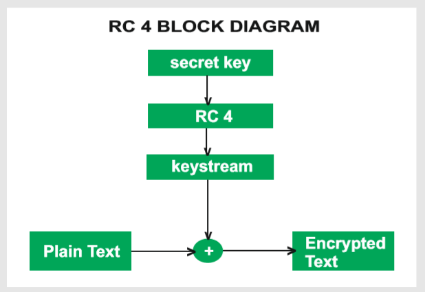

## 4. Hệ mật RC4

### 4.1 Lịch sử ra đời

RC4 là hệ mật mã dòng. Được đặc trưng bởi tốc độ thực hiện và sự đơn giản trong thuật toán.

Một số thông tin về RC4:

| RC4              | Rivest Cipher 4                   |
| ---------------- | --------------------------------- |
| Tác giả          | Ron Rivest(RSA Security)          |
| Phát hành/Phá vỡ | Ra đời năm 1987 - Bị phá năm 2015 |
| Loại             | Mã dòng                           |
| Giao thức        | WEP, TLS,...                      |

### 4.2 Mô tả thuật toán

Sơ đồ khối tổng quan thuật toán:

<p align="center">
    
</p>

Thuật toán của RC4 tập trung vào việc tạo ra dòng khóa (keystream) từ khóa bí mật. Mã hóa nhận được là kết quả của việc thực hiện phép XOR (bit wise) giữa keystream và Plain Text ( Ở đây keystream sẽ được tạo ra với độ dài tương đương với độ dài của Plain Text)

Việc tạo ra dòng khóa (keystream) được thể hiện qua sơ đồ sau:

<p align="center">
    
</p>

<br>
<br>

Qua sơ đồ khối có thể thấy dòng khóa được tạo ra qua việc thực hiện các hoán vị. Cụ thể là qua 2 lần hoán vị

- Lần 1: Lập lịch khóa (KSA)
- Lần 2: Sinh số giả ngẫu nhiên (PRGA)

Thuật toán RC4 được trình bày sau đây sẽ dựa trên mã ascii của các kí tự để thực hiện việc mã hóa (Việc tự tạo ra một bảng mã hóa các kí tự riêng là hoàn toàn hợp lệ, không bắt buộc phải dùng bảng mã ascii)


**Các giai đoạn thực hiện thuật toán:**

1. Khởi tạo

Do việc tạo ra keystream bản chất là dựa trên việc thực hiện các hoán vị. Vì thế ta cần tạo ra 2 mảng

- Mảng T tạo ra từ việc lặp đi lặp lại secret key(lấy mã ascii cho từng phần tử) cho đến khi kích thước mảng bằng 256

    Ví dụ: Key = 'LTMM'. Với mã ascii tương ứng như sau:

    kí tự | mã ascii
    ------|---------
    L|76
    M|77
    T|84

    Ta được mảng T = [76,77,84,76,77,84...] (T.size = 256)

- Mảng S là dãy số từ 0 - 255

Khi thực hiện hoán vị ở các bước tiếp theo, mảng T (mảng khóa ban đầu) sẽ không thay đổi. Chỉ thực hiện hoán vị trên mảng S.

Mã giả:

```python
    S:arr
    T:arr
    K:keyString
    n:keyLength

    for i = 0 to 255
        S[i] = i;
        T[i] = K[i mod n]
```

2. Lập lịch khóa (KSA)

Mã giả:

```python
    j = 0;
    for i = 0 to 255
        j = (j + S[i] + T[i]) mod 256
        swap(S[i], S[j])
```

3. Sinh số giả ngẫu nhiên(PRGA)

Mã giả:

```python
    i, j = 0
    n: plainTxtLength
    for m = 1 to n:
        i = (i +1) mod 256
        j = (j + S[i]) mod 256
        swap(S[i], S[j])
        keyStream.append(S[(S[i] + S[j]) mod 256])
```

4. Thực hiện phép XOR (bit wise) giữa keystream và plaintext ta được kết quả mã hóa

Mô phỏng thuật toán:

<p align="center">
    
<p>

### 4.3 Thực hiện thuật toán với Python
